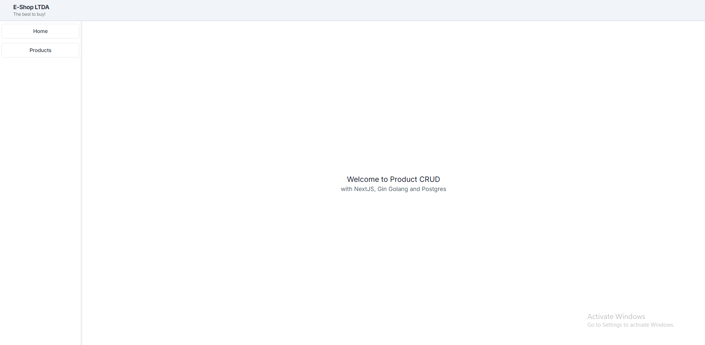

### How to run
#### database
- execute the database
```
docker-compose up
```

#### api
- start http server
```bash
go run main
```

#### frontend
- copy .env.example to .env
- start http server
```
npm run dev
```

### screenshots

Home.


Empty list product.


Add a product.


Add a product with data.


List with one product.


List with pagination.


Add/Update a product with form error.


Delete a product.


Update a product.

